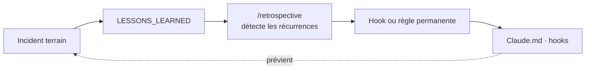

# SDLC Toolkit — Gouvernance Claude Code

> **Ce que c'est :** un modèle de gouvernance pour projets pilotés par Claude Code — règles permanentes (`Claude.md`), skills de clôture et de rétrospective, hooks — qui transforme chaque incident de session en règle vérifiable.
> **Pourquoi :** extrait d'un pipeline LLM en production quotidienne, où les mêmes erreurs d'agent revenaient d'un sprint à l'autre faute de mémoire entre les sessions.
> **État :** plus de 25 sprints, un registre de décisions versionné, et un contrôle exécutable du modèle lui-même (`bash sdlc-validate.sh` → 10 contrôles).

**Version courante : v2.0+ECO-8** · Licence MIT



Bootstrapper un nouveau projet, aligner un projet existant, faire évoluer le modèle.

---

## Ce que ça fait concrètement

Un projet gouverné par ce toolkit a :

- Un `Claude.md` qui donne à Claude Code des règles permanentes d'exécution (rôle, limites, workflow)
- Un skill `/wrap-up` qui clôture chaque sprint en 6 étapes (bilan → rétro → doc → commit)
- Un skill `/retrospective` qui détecte les patterns récurrents et propose des hooks ou règles
- Un skill `/sdlc-sync` qui aligne le projet sur une version plus récente du modèle sans écraser le tuning local
- Une boucle de rétroaction terrain : incident → `LESSONS_LEARNED` → `/retrospective` → hook ou règle permanente

**Quatre invariants guident toute évolution :**
- **INV-1 · Vérification exécutable** — tout test = une commande exacte, pas une description
- **INV-2 · Circuit fermé** — toute règle implicite devient explicite (hook, `DECISIONS.md`, ou `Claude.md`)
- **INV-3 · Contexte chirurgical** — Claude charge uniquement les fichiers listés dans `§Handoff`, pas le repo entier
- **INV-4 · Boucle de rétroaction** — toute observation terrain a un chemin vers une règle permanente

**Découpage amont / aval :** l'idéation, le cadrage produit et les
décisions d'architecture se font dans un Project Claude.ai dédié
(`10-AMONT-TEMPLATE.md`) — Claude Code prend le relais à partir du
Sprint 0, seul endroit où la vérité du code peut être vérifiée. Cette
phase amont est optionnelle.

---

## Structure du repo

```
sdlc-toolkit/
├── README.md                        # Ce fichier — pitch + démarrage rapide
├── LICENSE                          # MIT
├── 00-CONTEXT.md                    # Contexte Claude.ai — invariants + carte des fichiers
├── 01-Claude-md-TEMPLATE.md         # → Claude.md du projet cible
├── 02-STANDARDS-TEMPLATE.md         # → STANDARDS.md du projet cible
├── 03-wrap-up-SKILL-TEMPLATE.md     # → .claude/skills/wrap-up/SKILL.md
├── 04-sprint-PDR-TEMPLATE.md        # → specs/sprint-template.md (copie tel quel)
├── 04b-sdlc-sync-SKILL-TEMPLATE.md  # → .claude/skills/sdlc-sync/SKILL.md
├── 05-ROADMAP-TEMPLATE.md           # → docs/ROADMAP.md
├── 06-PDR-bootstrap.md              # Guide opérationnel Sprint 0 (référence, non copié)
├── 07-DECISIONS-SDLC.md             # Registre des décisions sur le modèle lui-même
├── 08-hooks-TEMPLATE.md             # → .claude/hooks/pre-tool-bash.sh + settings.json
├── 09-retrospective-SKILL-TEMPLATE.md  # → .claude/skills/retrospective/SKILL.md
├── 10-AMONT-TEMPLATE.md             # → Project Knowledge Claude.ai (hors repo)
├── 11-help-SKILL-TEMPLATE.md        # → .claude/skills/help/SKILL.md
├── 12-audit-externe-TEMPLATE.md     # Guide toolkit — audit framework tiers vs SDLC, pas copié
├── sdlc-init.sh · sdlc-validate.sh · sdlc-delta.sh · sdlc-project-check.sh · sdlc-token-usage.sh
│                                     # Scripts — voir docs/MODE-OPERATOIRE.html §Vérifier le modèle
├── tests/                           # sdlc-validate-test.sh — suite de tests du validateur
├── specs/                           # Sprints exécutés (specs/Sprints/) + template de sprint
├── .claude/                         # Hooks + skills installés dans ce repo (self-bootstrap)
└── docs/                            # Site de documentation (GitHub Pages) + SPEC.html/MODE-OPERATOIRE.html
```

---

## Démarrage rapide

### Nouveau projet

```bash
# 1. Cloner le toolkit
git clone https://github.com/laurentGELY/SDLC.git sdlc-toolkit

# 2. Depuis la racine du nouveau projet (git init déjà fait)
bash /chemin/vers/sdlc-toolkit/sdlc-init.sh "Nom du projet"

# 3. Ouvrir Claude Code et compléter la gouvernance
# (§Rôle, §Limites bash, SPEC.md, diagnostic skill)
# → voir le prompt exact dans docs/MODE-OPERATOIRE.html §Initialiser
```

### Projet existant à aligner

```bash
# Détecter la situation
grep "SDLC version" Claude.md STANDARDS.md 2>/dev/null || echo "ABSENT"
```

| Résultat | Action |
|----------|--------|
| Aucun fichier | → `sdlc-init.sh` (nouveau projet) |
| `ABSENT` | → `/sdlc-sync` dans Claude Code (delta complet) |
| `SDLC version : vX.Y` | → `/sdlc-sync` dans Claude Code (delta vX.Y → courant) |
| Version courante | Rien à faire ✓ |

```bash
# Dans Claude Code du projet cible
/sdlc-sync
```

---

## Faire évoluer le modèle

1. Lire `00-CONTEXT.md §Invariants` avant toute modification
2. Modifier le(s) template(s) concerné(s) — mettre à jour le numéro de version dans l'en-tête
3. Documenter la décision dans `07-DECISIONS-SDLC.md` (format `M-XXXX-NN`)
4. Mettre à jour `§Historique des versions` ci-dessous, ainsi que `docs/meta.json` et `docs/pages/versions.md` (site publié — C9), et le marqueur de version de `docs/SPEC.html` et `docs/MODE-OPERATOIRE.html` (C10), le tout contrôlé par `sdlc-validate.sh`
5. Commit `docs(sdlc): description · vX.Y → vZ.W`

> Après une évolution du modèle, tous les projets avec un marqueur de version antérieur sont candidats à un `/sdlc-sync`. Ce n'est pas automatique — décision humaine au cas par cas.

---

## Référence

### Fichiers créés dans le projet cible

| Source (toolkit) | Destination (projet) | Action au bootstrap |
|------------------|----------------------|---------------------|
| `01-Claude-md-TEMPLATE.md` | `Claude.md` | Adapter §Rôle · §Démarrage · §Limites bash |
| `02-STANDARDS-TEMPLATE.md` | `STANDARDS.md` | Vider §Modules partagés · §Carte des étapes |
| `03-wrap-up-SKILL-TEMPLATE.md` | `.claude/skills/wrap-up/SKILL.md` | Adapter §Étape 0b · §Étape 6 |
| `04-sprint-PDR-TEMPLATE.md` | `specs/sprint-template.md` | Copier tel quel |
| `04b-sdlc-sync-SKILL-TEMPLATE.md` | `.claude/skills/sdlc-sync/SKILL.md` | Copier tel quel |
| `05-ROADMAP-TEMPLATE.md` | `docs/ROADMAP.md` | Sprint 1 en §Now |
| `08-hooks-TEMPLATE.md §1` | `.claude/hooks/pre-tool-bash.sh` | Activer les sections pertinentes · `chmod +x` |
| `08-hooks-TEMPLATE.md §2` | `.claude/settings.json` | Copier tel quel |
| `09-retrospective-SKILL-TEMPLATE.md` | `.claude/skills/retrospective/SKILL.md` | Copier tel quel |
| *(from scratch)* | `CHANGELOG.md` | Header + entrée Sprint 0 |
| *(from scratch)* | `docs/DECISIONS.md` | Header + conventions préfixes |
| *(from scratch)* | `docs/LESSONS_LEARNED.md` | §Index vide + format |
| *(from scratch)* | `docs/DIAGNOSTIC_CMDS.md` | Header + format |
| *(from scratch)* | `specs/SPEC.md` | Structure vide du domaine |
| *(from scratch)* | `.claude/skills/diagnostic/SKILL.md` | Commandes de diagnostic |

### Skills disponibles dans Claude Code

| Commande | Quand | Fréquence |
|----------|-------|-----------|
| `/sdlc-init` | Repo vide — bootstrap complet | Une fois par projet |
| `/sdlc-sync` | Aligner sur une version SDLC plus récente | À chaque évolution du modèle |
| `/wrap-up` | Clôture de sprint | Fin de chaque sprint |
| `/retrospective` | Analyse de patterns sur N sprints | Toutes les ~5 sprints ou après incident |
| `/diagnostic` | Bug ou comportement inattendu | Sur incident |
| `/help` | Recap où on en est / où on va / outils disponibles | À la demande, en reprise de session |

### Types de sprint

| Type | Description | Output attendu |
|------|-------------|----------------|
| Feature | Nouvelle fonctionnalité | Code + tests + doc |
| Fix | Correction de bug ou régression | Code corrigé + test non-régression |
| Tuning | Seuils, prompts, paramètres | Mesure avant/après + `DECISIONS.md` |
| Doc | Documentation, process, SDLC | Fichiers doc mis à jour, zéro code |
| Spike | Investigation bornée dans le temps | Décision dans `DECISIONS.md` (pas de code) |
| Dette | Remboursement dette technique | Code nettoyé + test non-régression |
| SDLC-Sync | Alignement sur version SDLC plus récente | Marqueur version à jour + `D-SYNC-XX` |

---

## Documentation

- `docs/SPEC.html` — spec fonctionnelle du modèle : circuits, invariants, décisions M-XXXX
- `docs/MODE-OPERATOIRE.html` — procédures détaillées avec commandes copiables

Ouvrir directement dans un navigateur (fichiers locaux, non synchronisés dans Claude.ai).

---

## Historique des versions

<details>
<summary>Voir les 35 versions (v1.0 → v2.0+ECO-8)</summary>

| Version | Date | Changements principaux |
|---------|------|------------------------|
| v1.0 | 29/05/2026 | Bootstrap initial — 7 fichiers |
| v1.1 | 30/05/2026 | Bilan session (Étape 0 wrap-up) · Auto-exécution · Nettoyage artefacts · DIAGNOSTIC_CMDS obligatoire |
| v1.2 | 30/05/2026 | Hooks template · Boucle rétroaction LESSONS_LEARNED → hook · Given/When/Then PDR · Champ Interdit PDR · Vérification exécutable renforcée · Retrospective skill · Circuit remontée SDLC via [SDLC_CANDIDATE] |
| v1.3 | 03/06/2026 | sdlc-sync skill + sprint SDLC-Sync · MODE-OPERATOIRE.html · Mémoire de sprint intra-session |
| v1.4 | 04/06/2026 | Restructuration doc/ : SPEC.html + MODE-OPERATOIRE.html · 00-README.md → 00-CONTEXT.md |
| v1.5 | 05/06/2026 | Init sprint : spec + mémoire + plan de développement — séquence 4a→4d (M-PROC-12) |
| v1.6 | 11/06/2026 | Annotations sprint-memory (CONF/alternative/valide jusqu'à) · Handoff eager/lazy · §Dépendances PDR · index retrospective structuré (M-PROC-13→17, M-ARCH-07) |
| v1.7 | 11/06/2026 | Recommandation vérification externe si CONF FAIBLE · §PostToolUse Option A/B — lint + post-commit-changelog (M-PROC-18, M-HOOKS-03) |
| v1.8 | 14/06/2026 | Sprint SDLC-05a · Wrap-up robustesse : §0e revue objectif sprint, signaux rétrospectifs §0a, SESSION_BRIDGE accumulatif, vérification CLAUDE_PROJECT delta (M-PROC-19→22) |
| v1.9 | 14/06/2026 | Sprint SDLC-05b · CLAUDE_PROJECT versionné (`sdlc-project-check.sh`) · volumétrie minimum §Plan de test · §Observabilité STANDARDS en checklist Q/R actionnable (M-PROC-23/24, M-ARCH-08) |
| v1.9+SDLC-07 | 18/06/2026 | Import patterns BMad tactiques XS — bloc HALT (5 conditions, §Règles absolues), 3 principes anti-biais §Analyse, règle "affirmation citable" §Rôle · réorg `doc/` → `specs/Sprints/` |
| v1.9+SDLC-08 | 18/06/2026 | Import patterns BMad qualité/continuité — modes Index-guidé + seuil délégation sous-agent §Tokens, clause anti-complaisance §Test, reconstruction `sprint-memory.md` perdue · Significant Discovery Alert SD-1→5 (§Étape 2b retrospective) |
| v1.9+SDLC-09 | 18/06/2026 | Import patterns BMad P-04/P-05/P-03 — Adversarial Review 3 couches (§0f wrap-up, Taille M/L), verdict gate PASS/CONCERNS/FAIL (Demande d'aval), grille succès/échec optionnelle PDR taille L · clôture catalogue BMad (Spike SDLC-06) |
| v1.9+SDLC-10 | 18/06/2026 | Rangement catalogue BMad — `doc/ROADMAP.md` créé (6 patterns en survol §Later avec déclencheurs) · M-SCOPE-03 (pas de modes nommés `Claude.md §Rôle`) |
| v1.9+SDLC-11 | 18/06/2026 | Skill `/help` — recap lecture seule (sprint-memory, ROADMAP §Now/§Next, classification `Claude.md`), zéro suggestion (M-PROC-26) |
| v1.9+SDLC-12 | 18/06/2026 | Phase amont — `10-AMONT-TEMPLATE.md`, Project Claude.ai dédié séparé pour idéation/PRD/architecture, zéro marqueur de provenance côté Claude Code (M-SCOPE-04) |
| v1.9+SDLC-13 | 18/06/2026 | `specs/SPEC.md` du toolkit lui-même (dogfooding) — §Vue d'ensemble, §Architecture (diagramme de flux), §Modules vérifié contre l'état réel du repo |
| v1.9+SDLC-22 | 21/06/2026 | Instrumentation conso token réelle — `sdlc-token-usage.sh` (totaux + bucketisation sprint-memory) · §0c wrap-up sans collage manuel · §Métriques tokens M1/M2 dans retrospective (M-PROC-36) |
| v1.9+SDLC-23 | 21/06/2026 | Hook `PreCompact` × `sprint-memory.md` — checkpoint automatique avant compaction (7e type `CHECKPOINT`), schéma réel `compaction_reason` vérifié et corrigé vs PDR initial (M-HOOKS-08) |
| v2.0+ECO-1 | 02/09/2026 | `sdlc-validate.sh` — vérification exécutable du modèle, 8 contrôles tier 1 (M-PROC-40). *Gap non backfillé entre SDLC-23 et ici (SDLC-24, GSD-V1/V2, Audit-GSTACK, SDLC-25) — même précédent que `M-PROC-27` : discipline restaurée à partir d'ici, historique accepté tel quel.* |
| v2.0+ECO-2 | 03/09/2026 | Rédaction des templates — `00-CONTEXT.md §5` (description = déclenchement, forme de règle selon type d'échec), en-tête `04b-sdlc-sync-SKILL-TEMPLATE.md` réécrit (M-TMPL-05) |
| v2.0+SDLC-26 | 03/09/2026 | `/retrospective` (SDLC-21→ECO-2) — graduation `LL-T04` en règle permanente `Claude.md §Analyse` (M-PROC-41), index `LESSONS_LEARNED` recompté |
| v2.0+ECO-3 | 03/09/2026 | `STANDARDS.md §Barre qualité` (seuils chiffrés, plancher anti-affaiblissement, cliquet M1 10%, exceptions datées), Definition of Done référencée (M-PROC-42) |
| v2.0+ECO-4 | 03/09/2026 | Durcissement PDR — `§Pas de placeholders` (04-sprint-PDR-TEMPLATE), grep d'enforcement étendu au wrap-up, auto-revue du plan en 3 passes avant l'aval, champ `[coût si faux]` sur DÉCISION, règle de précédence ledger/git après compaction (M-PROC-43) |
| v2.0+ECO-5 | 03/09/2026 | `P-20` rescopé — hook `SessionStart` écarté (Claude.md recharge déjà nativement), pattern `.claude/rules/` documenté pour projets cibles (`§Tokens`, M-TMPL-06) |
| v2.0+SDLC-27 | 03/09/2026 | `/retrospective` (ECO-3→ECO-5) — garde-fou traçabilité `sprint-memory.md` (M-PROC-44, `LL-T08` gradué), rappel fenêtre `grep -A` dans `04-sprint-PDR-TEMPLATE.md` (`LL-T12`), clôture de 2 vieux `SDLC_CANDIDATE` invalidés par ECO-5 |
| v2.0+SDLC-28 | 04/09/2026 | `sprint-memory.md` = mécanisme de reprise (`P-27`) — correction de 2 citations fautives (`M-HOOKS-XX`→`M-HOOKS-08`, `Étend M-PROC-13`→`M-PROC-10`), carte `MODE-OPERATOIRE.html` ; `P-39` retiré, déjà résolu |
| v2.0+SDLC-29 | 04/09/2026 | `12-audit-externe-TEMPLATE.md` (`P-22`) — gabarit 7 sections/6 axes/verdicts étiquetés, renuméroté 10→12 (collision `10-AMONT-TEMPLATE.md`), `M-TMPL-07` |
| v2.0+SDLC-30 | 21/09/2026 | Rattrapage `docs/SPEC.html` + `docs/MODE-OPERATOIRE.html` (figés à v1.4) — fichiers 00→12, scripts, vérification factuelle, auto-revue, barre qualité, `sdlc-validate.sh` ; table des décisions remplacée par un résumé renvoyant au registre · contrôle C10 (`M-PROC-46`) |
| v2.0+SDLC-31 | 22/09/2026 | `/retrospective` — graduation `LL-T14` (total/comptage vérifié par commande, extension `§Vérification factuelle`, `M-PROC-48`) · 2 `SDLC_CANDIDATE` de 3 mois tranchés (`SD-5`) plutôt que reconduits |
| v2.0+SDLC-32 | 22/09/2026 | Rappel 4a-4d dans `04-sprint-PDR-TEMPLATE.md §Handoff` (`M-TMPL-08`) — clôt un `SDLC_CANDIDATE` de 3 mois et `LL-T05` |
| v2.0+SDLC-Audit-Strands-Harness | 23/09/2026 | Audit externe Strands Harness (AWS) — 1er audit au gabarit `12-audit-externe-TEMPLATE.md` : runtime d'agent ≠ gouvernance, 5 recommandations (1 IMPORTER / 1 ADAPTER / 3 REJETER), aucun template modifié |
| v2.0+SDLC-Import-Strands-Harness | 23/09/2026 | Import audit Strands (P-45) — exemples agent/LLM dans `02-STANDARDS-TEMPLATE.md §Observabilité` (`M-TMPL-09`), tableau du rôle des hooks dans `08-hooks-TEMPLATE.md` ; correction : `exit 1` ne bloque pas un hook |
| v2.0+ECO-7 | 23/09/2026 | Durcissement de `sdlc-validate.sh` — suite de tests `tests/sdlc-validate-test.sh` (1 cas RED par contrôle, 15/15), C3 au grain ligne (fin de l'exemption de 3 fichiers entiers), en-têtes d'incident et messages de correctif |
| v2.0+ECO-8 | 24/09/2026 | Suite de tests du validateur lancée à chaque wrap-up (Étape 3.5, `03-wrap-up-SKILL-TEMPLATE.md` v2.0) et checklist `00-CONTEXT.md §4` · C8 couvre `tests/*.sh` (16/16) |

</details>
